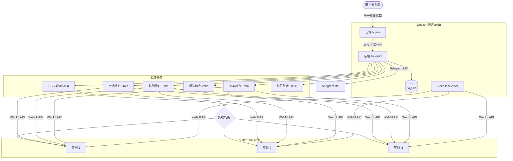
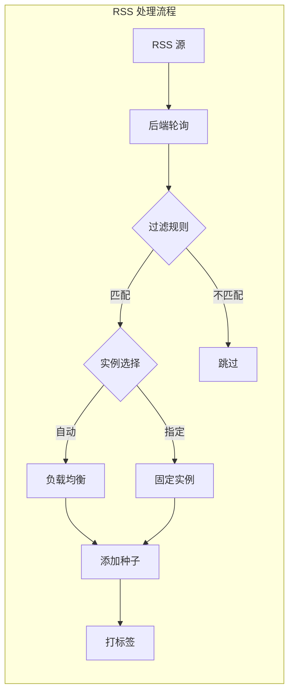
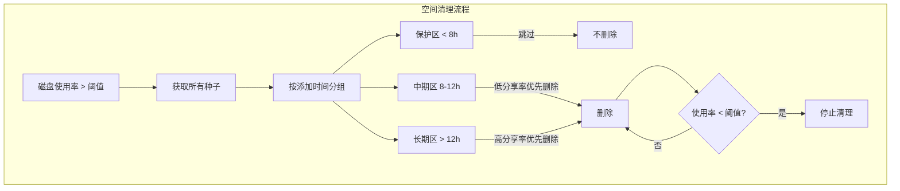

# AniBT-Speed

基于 qBittorrent 的个人种群加速管理平台。通过 Web 面板统一管理多个 qBittorrent 实例，自动订阅 RSS 新种、智能负载均衡分配下载任务、管理存储空间和做种队列、执行速率限制策略，并集成 PeerBanHelper 反吸血保护和 Telegram 通知推送。

参考项目：[PBH-BTN SwarmAccelerator](https://github.com/PBH-BTN/SwarmAccelerator-Project)

---

## 功能特性

### Web 管理面板

基于 React 19 + TypeScript + Tailwind CSS 构建的现代化管理界面，采用 Catppuccin Mocha 配色方案。使用 TanStack Router 进行类型安全路由，TanStack Query 管理服务端状态缓存与自动刷新，Recharts 渲染流量统计图表。所有策略参数均可通过面板在线调整，修改即时生效，无需重启服务或编辑配置文件。

### 多实例管理与智能负载均衡

支持同时连接和管理多个 qBittorrent 实例。当只有一个实例时，所有任务直接分配到该实例；当存在多个实例时，系统根据各实例的实时负载状态（活跃种子数、上传速度、暂停种子数）自动选择最优实例接收新任务。

负载均衡评分机制：

- 活跃种子数（权重 1.0）
- 当前上传速度 MB/s（权重 0.3）
- 暂停种子数（权重 0.2）

评分最低的实例被选为下一个新任务的目标。每个实例独立配置连接地址、认证信息和默认下载目录，通过 qBittorrent WebUI API 通信，支持一键测试连接。仪表盘汇总所有实例的上传/下载速度、活跃种子数和空间使用情况。

### RSS 自动订阅与标签管理

通过 Web 面板管理 RSS 订阅源，后端每 5 分钟轮询所有已启用的 RSS 源，检测新发布的种子。每个 RSS 源可独立配置：

- 目标实例：选择"自动（负载均衡）"由系统智能分配，或指定固定实例
- 下载保存路径
- 包含/排除关键字过滤器（使用 | 分隔多个关键字，支持正则）
- 刷新间隔
- 启用/禁用开关
- 自动标签：为该 RSS 源下载的所有种子自动打上指定标签

系统维护已处理条目列表，确保同一条目不会被重复添加。标签管理服务定期运行，确保标签正确应用到对应种子。

---

## 管理策略

### 存储空间管理与移除策略

系统每 5 分钟检查一次磁盘使用率，当达到设定的阈值时自动触发清理流程。

可配置参数（默认值）：

| 参数 | 默认值 | 说明 |
|------|--------|------|
| 启用开关 | 开启 | 是否启用自动空间管理 |
| 空间阈值 | 85% | 磁盘使用率达到此值时触发清理 |
| 保护时间 | 8 小时 | 添加不满此时间的种子强制保护，不会被删除 |
| 分界时间 | 12 小时 | 区分「中期」和「长期」种子的时间界限 |
| 单种子上限 | 不限 | 超过此大小的单个种子将被拒绝（0 表示不限） |
| 监控路径 | 可配置 | 监控磁盘使用率的文件系统路径 |

移除优先级规则：

触发清理时，系统将所有种子按添加时间分为三个区间，按以下优先级依次删除：

1. **保护区（添加不满 8 小时）**：强制保护，不参与清理。新种子需要时间完成初始分发，在此期间无论空间多紧张都不会被删除。

2. **中期区（满 8 小时但不满 12 小时）**：按分享率从低到高排序，优先删除分享率低的种子。此阶段种子已完成初始分发，分享率高的种子说明仍在被大量下载，应优先保留。

3. **长期区（满 12 小时以上）**：按分享率从高到低排序，优先删除分享率高的种子。此阶段高分享率种子已充分贡献，应优先保留分享率低的种子帮助初种和断种续传。

每删除一个种子后重新检查磁盘使用率，低于阈值即停止清理。删除时同时清理数据文件。

### 智能队列机制

系统每 3 分钟检查一次所有种子的 Peer 状态，当判定种子已广泛传播、无需继续占用资源时自动暂停，有新需求时自动恢复。

可配置参数（默认值）：

| 参数 | 默认值 | 说明 |
|------|--------|------|
| 启用开关 | 开启 | 是否启用自动队列管理 |
| 无下载者暂停 | 开启 | 当种子的下载者数为 0 时自动暂停 |
| 恢复阈值 | 0 | 下载者数大于此值时自动恢复做种 |
| 最短做种时间 | 1 小时 | 添加后不满此时间的种子不参与队列管理 |
| 排除标签 | 空 | 带有这些标签的种子不参与队列管理 |

暂停条件：

正在做种（uploading 或 stalledUP 状态）的种子，当其在所有 Tracker 及 DHT 网络上的下载者（leechers）数为 0 时，系统判定该种子已广泛传播，无人需要下载，自动暂停以节约带宽、CPU 和内存资源。

恢复条件：

已暂停的种子，当检测到有新的下载者出现（leechers 数量大于恢复阈值）时，系统自动恢复做种。

### 速率限制策略

系统每 1 分钟检查一次各实例状态，根据当前下载/做种情况动态调整限速参数，防止带宽被打满影响其他服务。

可配置参数（默认值）：

| 参数 | 默认值 | 说明 |
|------|--------|------|
| 启用开关 | 开启 | 是否启用自动限速管理 |
| 仅做种上传限速 | 100 MB/s | 无活动下载时的上传限速 |
| 有下载时上传限速 | 80 MB/s | 有活动下载时的上传限速 |
| 有下载时下载限速 | 60 MB/s | 有活动下载时的下载限速 |
| 滑动窗口开关 | 关闭 | 是否启用基于时间窗口的流量限制 |
| 每小时上传上限 | 200 GB | 滑动窗口：过去 1 小时内最大上传量 |
| 每 24 小时上传上限 | 2 TB | 滑动窗口：过去 24 小时内最大上传量 |

工作模式：

- 仅做种模式（无活动下载）：上传限速 100 MB/s，不限制下载。
- 下载模式（有活动下载）：上传限速 80 MB/s，下载限速 60 MB/s。保证下载有足够带宽的同时维持做种贡献。
- 滑动窗口限速（可选）：当过去 1 小时上传量达到限额或过去 24 小时上传量达到限额时，将上传/下载速度大幅降低直到窗口内流量回落。适用于有流量计费或需要严格控制总量的环境。

每分钟记录一次各实例的流量数据用于滑动窗口计算和仪表盘流量图表展示。

### 反吸血保护

集成 PeerBanHelper 提供反吸血保护。PeerBanHelper 作为独立容器运行，通过 qBittorrent WebUI API 连接各实例，监控 Peer 行为并自动封禁恶意客户端。

使用 PeerBanHelper 默认策略加 BTN 云端规则。首次启动后需通过 PeerBanHelper 管理界面完成初始配置，添加 qBittorrent 下载器连接。

### Telegram 通知

通过 Telegram Bot 推送关键事件和每日统计摘要。

可配置项：

| 参数 | 说明 |
|------|------|
| Bot Token | Telegram Bot API Token（通过 @BotFather 创建） |
| Chat ID | 接收通知的 Telegram 用户或群组 ID |
| 各事件开关 | 可独立启用/禁用每种通知类型 |

通知事件：

- 新种子添加（RSS 来源、目标实例）
- 存储空间告警（磁盘使用率超过阈值）
- 种子被删除（包含原因、分享率和年龄信息）
- 种子被暂停（队列机制触发，无下载者）
- 种子被恢复（检测到新下载者）
- 每日统计摘要（每天 20:00 推送，包含总上传量、活跃种子数、存储使用率）

---

## 技术架构

所有服务运行在独立的 Docker bridge 网络中，仅前端 Nginx 暴露单一端口供外部访问。后端和 PeerBanHelper 完全隔离在内部网络，通过 Docker DNS 互相通信。前端 Nginx 反向代理 `/api/` 请求到后端。







## 技术栈

| 层级 | 技术 |
|------|------|
| 前端 | React 19, TypeScript, Vite, Tailwind CSS, TanStack Router, TanStack Query, Recharts |
| 后端 | FastAPI, Python 3.11, SQLAlchemy, SQLite, APScheduler, qbittorrent-api, feedparser, PyJWT |
| 部署 | Docker Compose, Nginx |
| 反吸血 | PeerBanHelper |

## 定时任务

| 任务 | 间隔 | 说明 |
|------|------|------|
| RSS 轮询 | 5 分钟 | 轮询 RSS 源，负载均衡添加新种子 |
| 空间检查 | 5 分钟 | 检查磁盘使用率，超阈值触发清理 |
| 队列检查 | 3 分钟 | 检查 Peer 状态，暂停/恢复种子 |
| 标签检查 | 2 分钟 | 确保 RSS 源种子具有正确标签 |
| 速率检查 | 1 分钟 | 根据状态动态调整限速，记录流量 |
| 每日统计 | 每天 20:00 | 通过 Telegram 推送每日统计摘要 |

---

## 快速开始

### 前置条件

- Docker 和 Docker Compose
- 已运行的 qBittorrent 实例（需开启 WebUI API）

### 部署

```bash
git clone git@github.com:Yuri-NagaSaki/AniBT-Speed.git
cd AniBT-Speed

# 一键部署（自动生成 .env、构建镜像、启动服务、验证运行状态）
bash deploy.sh

# 或手动部署
cp .env.example .env
# 编辑 .env，设置 SECRET_KEY 和 ADMIN_PASSWORD
docker compose up -d --build
```

### 测试

```bash
# 运行健康检查（容器状态、API 端点、网络隔离、时区、数据持久化）
bash test.sh
```

### 认证

系统使用 JWT 认证，通过 `.env` 中的 `ADMIN_PASSWORD` 设置登录密码。Token 有效期 7 天。

---

## 页面说明

| 页面 | 说明 |
|------|------|
| 仪表盘 | 所有实例汇总视图：上传/下载速度、种子数、空间使用率、流量趋势图 |
| 实例管理 | 添加/编辑/删除 qBittorrent 实例，查看实时状态，测试连接 |
| RSS 管理 | 添加/编辑/删除 RSS 订阅源，配置过滤规则、自动标签和目标实例 |
| 空间策略 | 调整磁盘阈值、保护时间、分界时间、单种子上限 |
| 队列策略 | 调整暂停/恢复条件、最短做种时间、排除标签 |
| 限速策略 | 调整基础限速参数、滑动窗口开关和阈值 |
| Telegram | 配置 Bot Token 和 Chat ID，各事件通知开关，发送测试消息 |
| 日志 | 查看管理操作日志（添加、删除、暂停、恢复、告警等） |

---

## MediaInfo Agent（独立部署）

在每台 qBittorrent 服务器上部署的独立代理，自动为已完成的种子生成 MediaInfo 并推送到 Citrus（AniBT）站点展示。

### 工作流程

```
qBT 完成下载 → Agent 检测到已完成种子 → 本地运行 mediainfo CLI → 解析结构化数据 → PUT 到 Citrus API
```

### 特点

- **本地运行**：直接在 qBT 服务器上运行，无需 SSH 远程执行
- **info_hash 匹配**：通过种子 info_hash 自动匹配 Citrus 上的 Release，无需手动指定 releaseId
- **自动重试**：推送失败的种子在下次检查周期自动重试
- **路径映射**：支持 Docker qBT 容器路径到主机路径的映射（`PATH_MAPPING=/media:/hdd/media`）
- **SQLite 记录**：已处理种子记录在 `~/.mediainfo-agent/processed.db`，避免重复处理

### 部署

代理脚本位于 `scripts/mediainfo-agent/`：

```bash
# 复制到目标 qBT 服务器
scp -r scripts/mediainfo-agent/ root@your-qbt-server:/tmp/

# 在 qBT 服务器上执行安装（自动安装 mediainfo、Python 依赖、创建 systemd 服务）
ssh root@your-qbt-server "bash /tmp/mediainfo-agent/install.sh"

# 编辑配置
ssh root@your-qbt-server "vim /etc/mediainfo-agent/config.env"
```

### 配置项（`/etc/mediainfo-agent/config.env`）

| 变量 | 说明 | 示例 |
|------|------|------|
| `QBT_URL` | qBittorrent WebUI 地址 | `http://localhost:8080` |
| `QBT_USERNAME` | qBT 用户名 | `admin` |
| `QBT_PASSWORD` | qBT 密码 | `your-password` |
| `CITRUS_API_URL` | Citrus 站点地址 | `https://site.anibt.net` |
| `CITRUS_MEDIAINFO_TOKEN` | Citrus API 令牌 | `your-token` |
| `PATH_MAPPING` | 路径映射（Docker qBT 用） | `/media:/hdd/media` |
| `CHECK_INTERVAL` | 检查间隔（秒） | `300` |

### 管理命令

```bash
systemctl status mediainfo-agent     # 查看状态
systemctl restart mediainfo-agent    # 重启
journalctl -u mediainfo-agent -f     # 实时日志
journalctl -u mediainfo-agent -n 50  # 最近 50 行日志
```

---

## License

MIT
